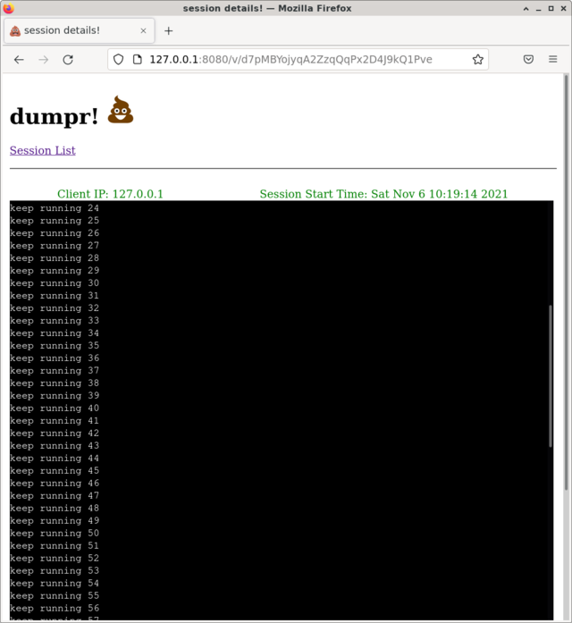

# dumpr!


[](https://opensource.org/licenses/MIT)[](https://goreportcard.com/report/github.com/alexj212/dumpr)

dumpr! is a tool to capture text based tcp traffic. The project came about for the need to capture a web request from the back end. It was also inspired by seashells.io. The server will expose 2 ports, a http server and a tcp server. 

All connection info along with inbound traffic is saved to a file. 
While a connection is active, a url is available that will provide live updates to the session log file. This allows a client to pipe a command output to dumpr!, and watch/share the output with a browser. A session log can be downloaded as well. 

If http traffic is detected the session is decoded and information is saved. The data is in a json format, will list path, protocol, headers and body. Multipart form uploads are parsed and saved to disk as well. URLs are available to download multipart upload files as well.

Various web service urls are available to list sessions, pull session info and files. The service will also launch a session reaper that will purge sessions older than 24 hours by default. This value can be changed with the option `--purgeOlderThan=24h`  . The value should be a proper time duration.

# Auto Responder
Another ability that dumpr! has is that it can be setup to return a custom response based on request pattern match. 

A match is made against the 'method' and 'path'. Any match that is made will send a response with the 'status_code', 'content-type' and 'response'. The 'method' and 'path' values can be regular expressions.

The auto responder system uses a yaml file to define the rules for the auto responder. The yml file can be defined with 

```bash
  --responses=responses.yaml    auto responder file
```

## responses.yaml 
```.yaml
responses:
  - method: .*
    name: rule 1
    path: /hello\.(txt|text)
    status_code: 200
    content_type: text/plain
    response: |
      Hello World!!!!
  - method: .*
    name: rule 2
    path: /hello\.json
    status_code: 200
    content_type: text/json
    response: |
      {
        "message": "Hello World"
      }

```

### Rule 1: 
* Will match any http method and path with the regular expression `/hello\.(txt|text)` 
* Will respond with status code 200, content_type `text/plain` and the response body `Hello World!!!!` 

### Rule 2: 
* Will match any http method and path with the regular expression `/hello\.json` 
* Will respond with status code 200, content_type `text/json` and the response body `{ "message": "Hello World" }` 


# WebCapture

Here is a typical usage of dumpr!. A client is making an http post to the dumpr! backend. The response below shows the autoresponder body. Also in the http response, dumpr! will add some response headers that provide urls to view the session details and assets.

```bash
$ http -f POST http://127.0.0.1:8081/hello.txt
POST /hello.txt HTTP/1.1
Accept: */*
Accept-Encoding: gzip, deflate
Connection: keep-alive
Content-Length: 0
Content-Type: application/x-www-form-urlencoded; charset=utf-8
Host: 127.0.0.1:8081
User-Agent: HTTPie/2.5.0


HTTP/1.1 200 OK
Content-Length: 16
Content-Type: text/plain
Date: Wed, 03 Nov 2021 00:23:55 GMT
X-AutoResponder-ID: 0
X-AutoResponder-Name: rule 1
X-Session-Info-URL: http://127.0.0.1:8080/api/info/92WQZePap1mwMGMDyVN0G7Ld4zlk3J
X-Session-Key: 92WQZePap1mwMGMDyVN0G7Ld4zlk3J
X-Session-URL: http://127.0.0.1:8080/v/92WQZePap1mwMGMDyVN0G7Ld4zlk3J

Hello World!!!!


```


# MultiPart File Upload
```bash
http -f POST http://127.0.0.1:8081/hello.world  files@avatar.png

POST /hello.world HTTP/1.1
Accept: */*
Accept-Encoding: gzip, deflate
Connection: keep-alive
Content-Length: 346059
Content-Type: multipart/form-data; boundary=2a8d0eea14d14e498086f221171ba2e2
Host: 127.0.0.1:8081
User-Agent: HTTPie/2.5.0


+-----------------------------------------+
| NOTE: binary data not shown in terminal |
+-----------------------------------------+
 

HTTP/1.1 200 OK
Content-Length: 494
Content-Type: application/json; charset=utf-8
Date: Sat, 06 Nov 2021 13:31:09 GMT
X-Session-Info-URL: http://127.0.0.1:8080/api/info/x8KyJVmvEld2o3lvQba2Y7P9aZBo0e
X-Session-Key: x8KyJVmvEld2o3lvQba2Y7P9aZBo0e
X-Session-URL: http://127.0.0.1:8080/v/x8KyJVmvEld2o3lvQba2Y7P9aZBo0e

{
    "code": "SESSION_CREATED",
    "infoURL": "http://127.0.0.1:8080/api/info/x8KyJVmvEld2o3lvQba2Y7P9aZBo0e",
    "name": "x8KyJVmvEld2o3lvQba2Y7P9aZBo0e",
    "requestBodyURL": "http://127.0.0.1:8080/t/x8KyJVmvEld2o3lvQba2Y7P9aZBo0e/body",
    "textURL": "http://127.0.0.1:8080/t/x8KyJVmvEld2o3lvQba2Y7P9aZBo0e",
    "uploadedFile_avatar.png_URL": "http://127.0.0.1:8080/t/x8KyJVmvEld2o3lvQba2Y7P9aZBo0e/avatar.png",
    "viewURL": "http://127.0.0.1:8080/v/x8KyJVmvEld2o3lvQba2Y7P9aZBo0e"
}

```

# Streaming Logs
There is a check that will malke sure a session can only capture a log file up to a specific size. This value can be configured with the option,
`--maxSessionSize=5          maximum session size in gb.`


```bash
$ ticker.sh|nc 127.0.0.1 8081
view at http://127.0.0.1:8080/v/d7pMBYojyqA2ZzqQqPx2D4J9kQ1Pve

```



# Web Service URLS
Web service urls are provided to access list of session, session info, assets and auto responder rules.   

```
/                           - html listing of sessions
/about                      - about the project
/t/:name                    - return the log file for a session.
/t/:name/:filename          - return a file uploaded in a multi part upload session.
/v/:name                    - live view html page    
/v/:name/ws                 - websocket for live updated for a session log file.
/api/list/sessions          - return a json array of all sessions.
/api/list/active            - return a json array of active sessions.
/api/list/inactive          - return a json array of inactive sessions.
/api/info/:name             - return json structure of the session.
/api/autoresponder/:id      - return auto responder for rule id.
/api/autoresponder/list     - return list of all auto responders.

Any unknown url is logged.
```

# Building

```.bash
make dumpr
```
Will create a binary `./bin/dumpr`

# Running

```.bash
./bin/dumpr
```

This will launch the web server on localhost:8080 and the tcp server on 8081. A Session is stored in the following /tmp/<date>/<session id>


## Options 
  * --saveDir=/tmp
    * Sets the save directory for http/tcp connections. 

  * --webDir=./web
    * Set the dir for the app to use for the web assets, and templates. Only needed for creating custom templates.

  * --publicIP=127.0.0.1
    * Set the public ip for the service. This is used for populating templates with urls or response headers.
 
  * --publicHttpPort=8080
    * Set the public port for the http service. This is used for populating templates with urls or response headers.

  * --port=8080
    * Set the port for the http service.

  * --tcpport=8081
    * Set the port for the tcp service.

  * --publicTCPPort=8081
    * Set the public port for the tcp service. This is used for populating templates with urls or response headers.

  * --responses=responses.yaml
    * Define the auto responder file for the service. 

  * --export
    * Will make the application export the embedded templates to --webDir value. The application will exit once completed. The templates can then be customized. 
    
  * --purgeOlderThan=24h        
    * Purge sessions from disk older than value. 0 will disable.

  * --maxSessionSize=5          
    * maximum session size in mb
